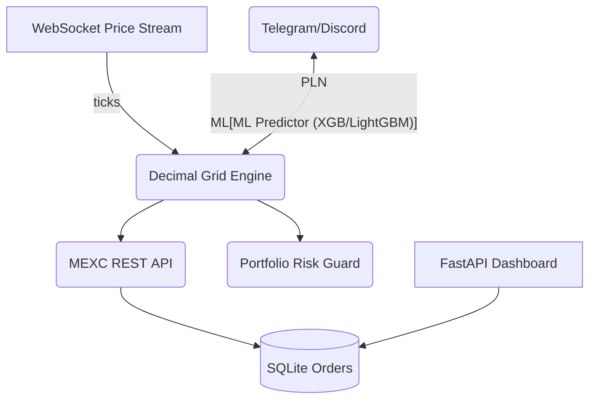

# MEXC Golden Decimal Advanced Trading System
سیستم معاملاتی هوشمند، قدرتمند و دقیق، مبتنی بر تحلیل اعشارهای طلایی در بازار رمزارز  
*A smart, robust, and precise trading system based on golden decimal analysis for the cryptocurrency market*

---

## 📖 معرفی | Introduction

**فارسی:**  
این پروژه یک سیستم معاملاتی پیشرفته است که با بهره‌گیری از تحلیل اعشارهای طلایی (Golden Decimals) و الگوریتم‌های تکنیکال، سیگنال‌های خرید و فروش را در بازار رمزارز به‌صورت خودکار تولید، ثبت و مدیریت می‌کند.  
ویژگی اصلی این سیستم، شناسایی نقاط حساس قیمتی بر اساس الگوهای اعشاری و تایید با ابزارهایی نظیر RSI، EMA و مدیریت ریسک است.

**English:**  
This project is an advanced trading system that leverages golden decimal analysis and technical algorithms to automatically generate, record, and manage buy/sell signals in the crypto market.  
Its main feature is the detection of key price points based on fractional (decimal) patterns, validated by tools such as RSI, EMA, and risk management modules.

---

## 🚀 ویژگی‌ها | Features

- تحلیل و شناسایی خودکار الگوهای اعشار طلایی (Golden Decimals)
- یکپارچه با صرافی MEXC با استفاده از CCXT
- مدیریت سیگنال‌ها و معاملات در پایگاه داده SQLite
- پشتیبانی از چندین جفت‌ارز و تایم‌فریم (BTC, ETH, SOL, ...)
- محاسبه حجم معامله بر اساس مدیریت ریسک
- ثبت کامل عملکرد (Performance Tracking)
- اتصال بلادرنگ با WebSocket
- گزارش‌گیری و لاگ حرفه‌ای
- توسعه‌پذیر و قابل شخصی‌سازی
- مستندات کامل و کدنویسی تمیز (Clean Code & Docs)

---

## ⚡ نصب و راه‌اندازی سریع | Quick Start

```bash
git clone https://github.com/behicof/mexc-golden-decimal-trader.git
cd mexc-golden-decimal-trader
pip install -r requirements.txt
# فایل config را ویرایش کرده و کلید API خود را وارد کنید
python main.py
```

- نیازمند Python 3.8+
- قبل از اجرا، دسترسی به API صرافی MEXC را فعال کنید.

---

## 📁 ساختار فایل‌ها | File Structure

```
mexc-golden-decimal-trader/
├── main.py                 # هسته سیستم معاملاتی
├── requirements.txt        # وابستگی‌ها
├── data/                   # دیتابیس SQLite و داده‌های ذخیره‌شده
├── logs/                   # لاگ‌ها
├── README.md               # همین فایل
└── ...                     # سایر ماژول‌ها و ابزارها
```

---

## 🏆 لایسنس | License

این پروژه تحت لایسنس MIT منتشر شده است.  
This project is released under the MIT License.

---

## 👤 درباره نویسنده | About the Author

**بهروز بوذری (behrouzboozari)**  
بنیان‌گذار و طراح سیستم‌های معاملاتی پیشرفته  
_مهارت‌ها:_ Python, CCXT, SQLite, WebSocket, تحلیل تکنیکال، مدل‌سازی اعشاری  
_شعار:_ «هر روز یک قدم به سمت هوشمندی بیشتر!»

[GitHub](https://github.com/behicof)

---

## 💎 پروژه‌های شاخص | Featured Projects

1. **MEXC Golden Decimal Advanced Trading System** *(این پروژه)*
2. ... (در صورت تمایل می‌توانید پروژه‌های دیگر را اضافه کنید)

---# Golden Decimal Advanced Trading System (MEXC)

> **Inspired by Behrouz Bouzari – OMNI Project**
>
> *Master the art of precision grid‑trading with decimal pivots, ML‑assisted signals, and real‑time dashboards.*

---

## Table of Contents

1. [Overview](#overview)
2. [Key Features](#key-features)
3. [Architecture](#architecture)
4. [Quick Start](#quick-start)
5. [Configuration](#configuration)
6. [Strategy Logic](#strategy-logic)
7. [Back‑testing](#back-testing)
8. [Dashboard & Monitoring](#dashboard--monitoring)
9. [Security Notes](#security-notes)
10. [Roadmap](#roadmap)
11. [Contributing](#contributing)
12. [License](#license)
13. [Disclaimer](#disclaimer)
14. [نسخهٔ فارسی / Persian Section](#نسخهٔ-فارسی)

---

## Overview

Golden Decimal is an **algorithmic grid‑trading engine** that places layered buy/sell orders around price *pivot decimals* (3, 6, 9, 36, 96 …).
It fuses classic technical indicators (RSI, EMA) with optional ML predictors (XGBoost & LightGBM) to adjust grid density and trade sizing in real‑time.

## Key Features

| Category            | Details                                                                                         |
| ------------------- | ----------------------------------------------------------------------------------------------- |
| **Grid Engine**     | Auto‑placed limit orders above/below price using decimal pivots; adaptive step‑size & quantity. |
| **Indicators**      | RSI, EMA, ATR, optional ML‑confidence feed.                                                     |
| **Risk Control**    | Fixed %‑risk, trailing stop, portfolio‑level circuit‑breaker.                                   |
| **Multi‑Threading** | Separate threads for data stream, order manager, and notification hub.                          |
| **Back‑Testing**    | Tick‑level simulator identical to live code (vectorbt‑style).                                   |
| **Dashboard**       | FastAPI + Vue3 panel (live P/L, open grids, kill‑switch).                                       |
| **Alerts**          | Telegram & Discord bots with AI‑generated trade summaries.                                      |
| **Dockerised**      | One‑command deployment `docker compose up`.                                                     |

## Architecture



## Quick Start

1. **Clone** the repo

   ```bash
   git clone https://github.com/behicof/golden-decimal.git
   cd golden-decimal
   ```
2. **Install deps** (venv recommended)

   ```bash
   pip install -r requirements.txt
   ```
3. \*\*Create \*\*\`\` (sample provided) and add your **MEXC API key/secret**.
4. **Run bot**

   ```bash
   python main.py --pair BTC/USDT
   ```
5. **Open dashboard** at [http://localhost:8000](http://localhost:8000).

### Docker

```bash
docker compose up -d
```

## Configuration

```yaml
exchange:
  name: mexc
  api_key: MXC_KEY
  api_secret: MXC_SECRET
strategy:
  base_step_pct: 0.2  # grid spacing
  levels: 15          # grid depth
  decimal_pivots: [3, 6, 9, 36, 96]
  take_profit_pct: 0.8
  stop_loss_pct: 0.5
ml:
  enable: true
  model_path: models/xgb_btc.joblib
risk:
  max_daily_loss_pct: 5
  allocation_pct: 30  # of account balance
notifications:
  telegram_token: YOUR_TOKEN
  telegram_chat_id: YOUR_CHAT
```

## Strategy Logic

1. Detect nearest **higher‑order decimal pivot** relative to mid‑price.
2. Place symmetric grid orders around pivot with `base_step_pct` spacing.
3. **RSI filter** guards against over‑extended entries.
4. If `ML.enable=true` → adjust grid density via confidence score.
5. Close grid (or partial) on TP/SL or on pivot breach.
6. Risk guard halts all trading if `max_daily_loss_pct` exceeded.

## Back‑Testing

```bash
python backtest.py --pair BTC/USDT --from 2023-01-01 --to 2025-01-01 --granularity 1m
```

Outputs JSON + CSV and an HTML tear‑sheet (Sharpe, DD, expectancy …).

## Dashboard & Monitoring

* **FastAPI endpoints**: `/positions`, `/pnl`, `/health`
* **Web UI**: Vue3 + lightweight‑charts, auto‑refresh via WebSocket.
* **Kill‑switch**: Hard stop all grids with one click.

## Security Notes

* API keys are AES‑256‑GCM encrypted at rest.
* `.env` holds encryption password – keep it outside version control.
* **Never** commit real keys; use `.env.example`.

## Roadmap

*

## Contributing

Pull Requests are welcome! Please run `pre‑commit` and add unit tests for any new logic.

## License

This project is released under the **MIT License**.
See [LICENSE](LICENSE) for details.

## Disclaimer

> Trading cryptocurrencies involves significant risk.
> This software is **for educational purposes only**.
> You assume full responsibility for any financial decisions.

---

## نسخهٔ فارسی

### معرفی

**Golden Decimal** یک موتور معاملاتی **گرید (Grid)** است که سفارش‌های خرید / فروش را حول اعشارهای کلیدی (۳، ۶، ۹، ۳۶، ۹۶ و …) لایه‌بندی می‌کند. این سیستم با ترکیب اندیکاتورهای کلاسیک (RSI، EMA) و پیش‌بینی‌گرهای یادگیری ماشین، چگالی شبکه و حجم سفارش را به‌صورت زنده تنظیم می‌کند.

### قابلیت‌ها

| دسته                     | توضیحات                                                            |
| ------------------------ | ------------------------------------------------------------------ |
| **موتور گرید**           | ایجاد خودکار سفارش‌های محدود بر اساس اعشار طلایی با گام و حجم پویا |
| **اندیکاتورها**          | RSI، EMA، ATR + خوراک اطمینان ML                                   |
| **کنترل ریسک**           | درصد ریسک ثابت، استاپ دنباله‌دار، قطع‌کنندهٔ سبد                   |
| **پشتیبانی Multithread** | جریان قیمت، مدیریت سفارش و اعلان مستقل                             |
| **بک‌تست تیک‑به‑تیک**    | شبیه‌ساز دقیق با همان منطق اجرای زنده                              |
| **داشبورد وب**           | پنل FastAPI + Vue3 با نمودار زنده و Kill‑switch                    |

### راه‌اندازی سریع

```bash
# نصب وابستگی‌ها
pip install -r requirements.txt
# تنظیم کلیدها در config.yaml
python main.py --pair BTC/USDT
```

داشبورد: [http://localhost:8000](http://localhost:8000)

### تنظیمات حیاتی (نمونه)

```yaml
strategy:
  decimal_pivots: [3, 6, 9]
  levels: 12
risk:
  max_daily_loss_pct: 5
```

### نقشهٔ راه

* نسخهٔ **۰٫۳**: مدل ML آمادهٔ دانلود
* نسخهٔ **۰٫۵**: انتشار رسمی + لایسنس Open‑Core

### مجوز و سلب مسئولیت

مجوز **MIT** – استفادهٔ آزاد با ذکر منبع.
تمامی ریسک معاملات بر عهدهٔ کاربر است.

---


<div align="center">
  
  ⭐️ اگر این پروژه برای شما مفید بود، ستاره بدهید و سوالات یا پیشنهادات خود را در Issues مطرح کنید!  
  <br/><br/>
  
  
</div>
